---

marp: true
theme: default
color: #000
backgroundColor: #fff
enableHtml: true	
paginate: true
style: |
  .columns {
    display: grid;
    grid-template-columns: repeat(2, minmax(0, 1fr));
    gap: 1rem;
  }
  .columns-left {
    background: white;
  }
  .columns-right {
    background: white;
  }

---

# Preventing Specimen Hemolysis and Blood Culture Contamination with Automated Collector Evaluations

 

### Mark A Zaydman, MD, PhD
Assistant Professor 
Department of Pathology and Immunology
Washington University School of Medicine

---

<h1>
  Disclosures
</h1>
<h5>
  Research Support
</h5>

  bioMerieux 

<h5>
  Speaking Honoraria
</h5>

  Sebia - "A Modern Approach to Screening for MGs using Digital Workflows" 
  Siemens - "FLC Testing in Multiple Myeloma and Kidney Disease" 
  API - 2023 Annual Summit (Pittsburgh, PA) 
  ADLM - 2023 Annual Scientific Meeting (Anaheim, CA)

<h5>
  Patents
</h5>

  US20210311046 - Method of Reducing Interference in Immunoassays
  WO2022198218A1 - Spectral Correlation Analysis of Layered Evolutionary Signals

---

<h1>
  Hemolysis and Blood Culture Contamination
</h1>

> Common and costly errors occuring during specimen collection

  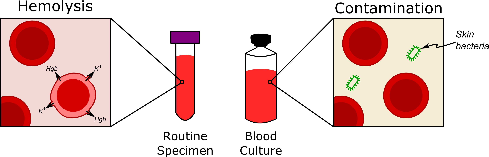

---

<!-- <h1><i>In vitro</i> Hemolysis Occurs During or After Collection</h1> -->
<!--   -->

  

    

      <h3>
        <ins><i>In vitro</i> hemolysis</ins>   
      </h3>
      Non-biological rupturing of blood cells leading to the release of intracellular contents into the fluid fraction of the specimen (ex. Potassium, Hemoglobin)
    

  

  

    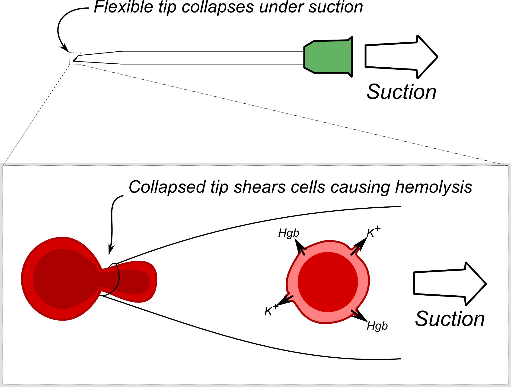
  

 

Lippi, Giuseppe, Gianfranco Cervellin, and Camilla Mattiuzzi. “Critical Review and Meta-Analysis of Spurious Hemolysis in Blood Samples Collected from Intravenous Catheters.” Biochemia Medica, 2013, 193–200. https://doi.org/10.11613/BM.2013.022.

---

<h2><i>In vitro</i> Hemolysis Interfers with Laboratories in Complex Ways</h2>
 

  

    

      <ins>Hemoytic inteference mechanisms</ins> 
      &nbsp;- Elevation of intracellular analytes 
      &nbsp;- Dilution of extracellular analytes 
      &nbsp;- Optical interferance 
      &nbsp;- Enzymatic interferance 
    

  

  

    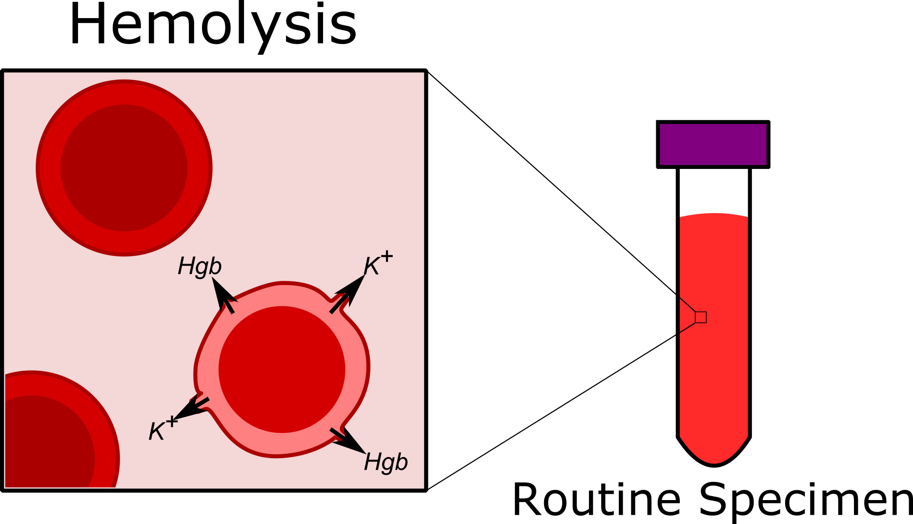
  

 

  Lippi, Giuseppe, Norbert Blanckaert, Pierangelo Bonini, Sol Green, Steve Kitchen, Vladimir Palicka, Anne J. Vassault, and Mario Plebani. “Haemolysis: An Overview of the Leading Cause of Unsuitable Specimens in Clinical Laboratories.” Clinical Chemistry and Laboratory Medicine 46, no. 6 (January 1, 2008). https://doi.org/10.1515/CCLM.2008.170.

---

<h2><i>In vitro</i> Hemolysis is the Most Common Cause of Sample Rejection</h2>
 

  

    

      Inaccurate results can harm patients
    

    

      Laboratories monitor for free Hgb 
      &nbsp;- Visual inspection 
      &nbsp;- Spectrophotometric detection 
    

    

      Hemolyzed specimens may be rejected 
      &nbsp;- the most frequent cause of rejection
    

  

  

    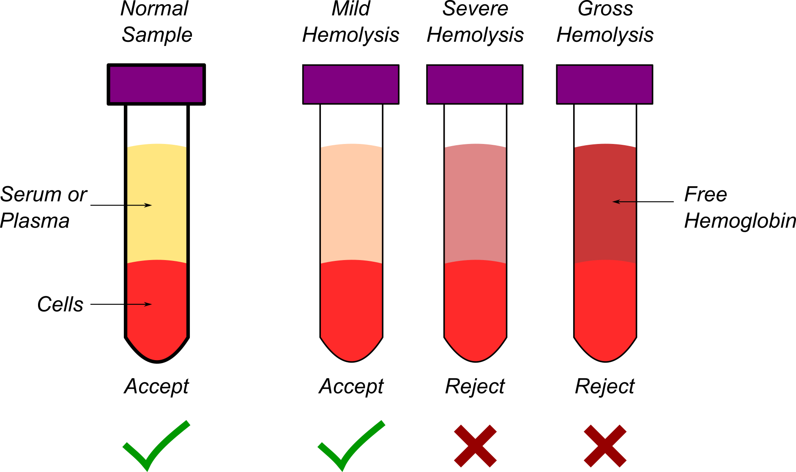
  

 

  Jones, B. A., R. R. Calam, and P. J. Howanitz. “Chemistry Specimen Acceptability: A College of American Pathologists Q-Probes Study of 453 Laboratories.” Archives of Pathology & Laboratory Medicine 121, no. 1 (January 1997): 19–26.

---

<h2>Specimen Rejection Degrades Care and Increases Costs</h2>

  

    

      <strong><ins>Degraded care</ins></strong> 
      &nbsp;- Delayed/missed diagnosis 
      &nbsp;- Repeat phlebotomy 
    

    

      <strong><ins>Increased costs</ins></strong> 
      &nbsp;- Prolonged length of stay 
      &nbsp;- Consumables 
      &nbsp;- Nurse/phlebotomists time 
      &nbsp;- Laboratory resources 
      &nbsp;- Downstream harms of medical errors* 
      &emsp;*Difficult to account for
    
    
  

  

    <table style='padding-top:10px;padding-bottom:10px;text-align:center'>    
      <tr>
        <th>Setting</th>
        <th>Costs</th>
        <th>Reference</th>
      </tr>
      <tr>
        <td>Emergency</td>
        <td>$600.00</td>
        <td style='font-size:16px'>Phelan, Michael P., et. al., JALM 6(6):2021,  Pgs 1607–1610</td>
      </tr>                              
      <tr>
        <td>Inpatient</td>
        <td>$357.15</td>
        <td style='font-size:16px'>Green, Sol F. Clin Biochem 46(13-14):2013, Pgs 1175–79</td>
      </tr>
      <tr>
        <td>Critical care</td>
        <td>$162.18</td>
        <td style='font-size:16px'>Green, Sol F. Clin Biochem 46(13-14):2013, Pgs 1175–79</td>
      </tr>
      <tr>
        <td>Outpatient</td>
        <td>$337.05</td>
        <td style='font-size:16px'>Green, Sol F. Clin Biochem 46(13-14):2013, Pgs 1175–79</td>
      </tr>
    </table>
  

 

  Doern, Gary V., Karen C. Carroll, Daniel J. Diekema, Kevin W. Garey, Mark E. Rupp, Melvin P. Weinstein, and Daniel J. Sexton. “Practical Guidance for Clinical Microbiology Laboratories: A Comprehensive Update on the Problem of Blood Culture Contamination and a Discussion of Methods for Addressing the Problem.” Clinical Microbiology Reviews 33, no. 1 (December 18, 2019): e00009-19. https://doi.org/10.1128/CMR.00009-19.

<!-- 
---

<h1>
  Hemolysis is the Most Common Preanalytical Error
</h1>

  

  

  

  
  

 -->

---

<h1>Blood Culture Contamination</h1>
 

  

    

      <ins>Blood culture contamination</ins>
    

    

      The introduction of non-pathogenic bacteria from the patients skin or environment into a blood culture speimen during collection giving the false impression that the patient has a blood stream infection 
    

  

  

    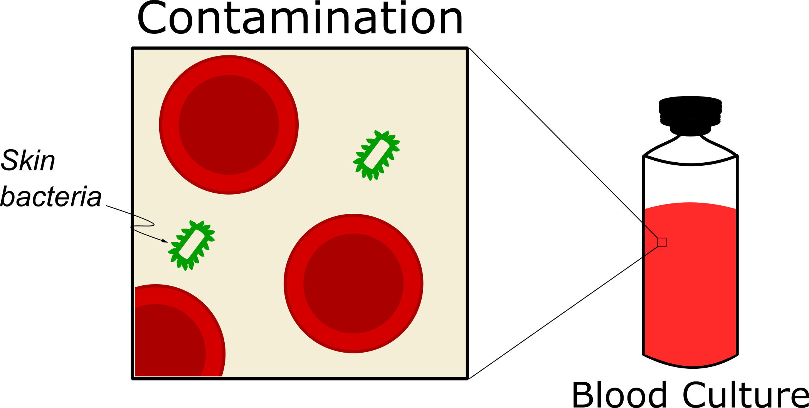
  

 

  Doern, Gary V., Karen C. Carroll, Daniel J. Diekema, Kevin W. Garey, Mark E. Rupp, Melvin P. Weinstein, and Daniel J. Sexton. “Practical Guidance for Clinical Microbiology Laboratories: A Comprehensive Update on the Problem of Blood Culture Contamination and a Discussion of Methods for Addressing the Problem.” Clinical Microbiology Reviews 33, no. 1 (December 18, 2019): e00009-19. https://doi.org/10.1128/CMR.00009-19.

---

<h1>Blood Culture Contamination Causes Broad Harms</h1>

  

    

      <ins>Patient</ins>  
      - 3 additional days of IV antibiotics 
      - 1-5 additional days of hospitalization 
      - $9,000 additional hospitalization costs
    

    

      <ins>Microbiology lab</ins>  
      - Technician time 
      - Reagents
    
    
    

      <ins>Hospital</ins>  
      - Costs  of prolonged hospitalization 
      - Quality penalties (CLABSI)
    
        
    

      <ins>Public</ins>  
      - Increase prevalence of MDRO
    
        
  

  

    
      
    

      Bates, David W. JAMA 265, no. 3 (January 16, 1991): 365.  
      Gander, RM et. al. JCM 47, no. 4 (April 2009): 1021–24. 
      Doern, GV et al. CMR 33, no. 1 (December 18, 2019): e00009-19. 
    

  

<!-- ---

<h1>
  Blood Culture Contamination is Common
</h1>

  

  

  

  
  

 -->

---

<h1>
  Training and Feedback Synergistically Reduce Specimen Collection Error Rates
</h1>

  

  

  

  
  

<!-- 
---

<h1>
  Training and Feedback Reduce Contamination Rates
</h1>

  

  

  

  
  

 -->

---

<h2>
 Barriers to Implementing Collector Feedback and Training 
</h2>
 

  

---

<h2>
  Our Hypothesis
</h2>

  We hypothesized that digital technologies        can remove the barriers to mounting an effective education and feedback campaign to reduce specimen collection error rates

  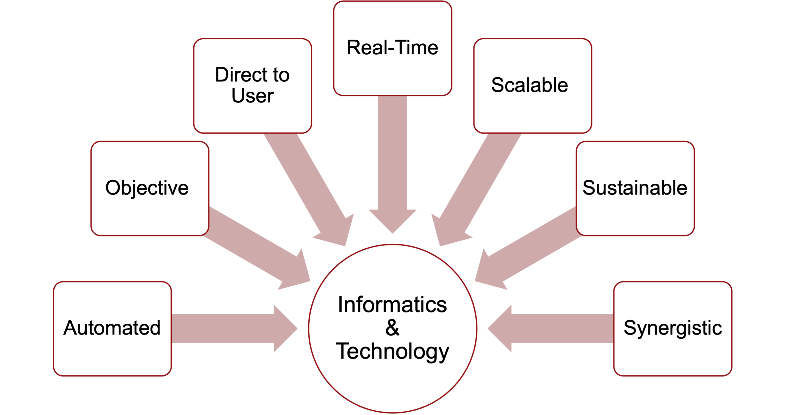

---

<h1>
  Our goal
</h1>

  To develop an end-to-end automated solution to provide scalable and sustainable collector feedback and performance-based training to reduce specimen collection errors 

  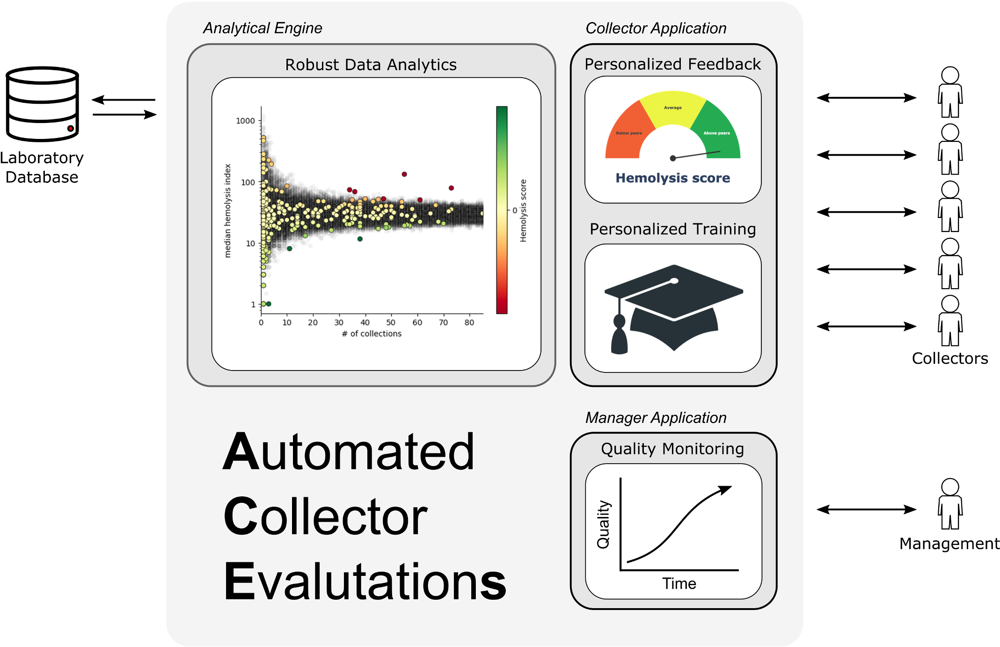

---

  <h2>
    Outline for this Talk 
  </h2>

  <h3>
    Part 1
  </h3>
  

    

      Estimating the costs and drivers of specimen hemolysis
    

  

  <h3>
    Part 2
  </h3>
  

    

      Automating the dectection of underperforming specimen collectors
    

  
  
  <h3>
    Part 3
  </h3>
  
  
    

      Automating the delivery of personalized collector feedback and training
    

  

 
 

---
<h1>
  Part 1
</h3>

  

    Estimating the costs and drivers of specimen hemolysis
  

---

  

    <h1>
      Study Context
    </h1>
    <h5>
      Barnes-Jewish Hospital (BJH)
    </h5>
    

      &bull; St. Louis, Missouri, USA 
      &bull; 1266 adult beds 
      &bull; Tertiary academic care center 
      &emsp;- Washington University &emsp;&nbsp;&nbsp;&nbsp;School of Medicine 
    

  

     
     
  

---

<h2>
  Study Design
</h2>

  

    <!-- <h3>
      <ins>Hemolysis costs</ins>
    </h3> -->
    <strong>Retrospective:</strong> 1/1/2022 to 1/1/2023 
    <strong>Single-institution:</strong> Barnes-Jewish Hospital 
    <strong>Study design:</strong> Observational 
    <strong>Data source:</strong> LIS (Cerner Millenium, Oracle)
    <strong>Inclusion criteria:</strong>  
    &emsp;&bull; Specimen drawn in study period 
    &emsp;&bull; Hemolysis index (HI) measured 
    <strong>Cost model:</strong>  
    &emsp;&bull; Redrawn if HI > threshold for 1+ analyte 
    &emsp;&bull; Fixed, context dependent redraw costs 
  

  

    <table style='padding-left:20px;padding-bottom:10px;text-align:center;font-size:24px'>    
      <tr>
        <th>Setting</th>
        <th>Costs</th>
        <th>Reference</th>
      </tr>
      <tr>
        <td>Emergency</td>
        <td>$600.00</td>
        <td style='font-size:16px'>Phelan, Michael P., et. al., JALM 6(6):2021,  Pgs 1607–1610</td>
      </tr>                              
      <tr>
        <td>Inpatient</td>
        <td>$357.15</td>
        <td style='font-size:16px'>Green, Sol F. Clin Biochem 46(13-14):2013, Pgs 1175–79</td>
      </tr>
      <tr>
        <td>Critical care</td>
        <td>$162.18</td>
        <td style='font-size:16px'>Green, Sol F. Clin Biochem 46(13-14):2013, Pgs 1175–79</td>
      </tr>
      <tr>
        <td>Outpatient</td>
        <td>$337.05</td>
        <td style='font-size:16px'>Green, Sol F. Clin Biochem 46(13-14):2013, Pgs 1175–79</td>
      </tr>
    </table>
  

---

  

    <h1>
      Hemolysis Indices
    </h1>
    Automated detection and quantitation 
    Based on spectrophotemetric measurement  
    <ins>BJH</ins> 
    &bull; Measured on Roche Cobas c702 
    &bull; Plasma samples 
  

  

    

      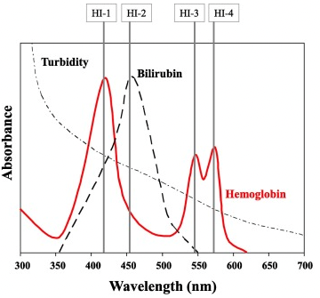
      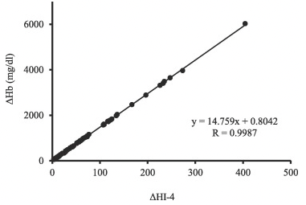
    

  

  Ishiguro, Akiyo, Mitsuaki Nishioka, Akihiro Morishige, Reo Kawano, Toshihiko Kobayashi, Aki Fujinaga, Fumiya Takagi, et al. “What Is the Best Wavelength for the Measurement of Hemolysis Index?” Clinica Chimica Acta 510 (November 2020): 15–20. https://doi.org/10.1016/j.cca.2020.06.046.

---

<h3>
  Annual Institutional Hemolysis Redraw Costs are Nearly $4,000,000
</h3>

  

    <ins>
      Assumptions 
    </ins>
    &bull; Results supressed for HI > threshold 
    &bull; All specimen with supressed results  &emsp;incur redraw costs
  

  

    <table style='margin-top:0px;margin-left:50px;text-align:right'>
      <tr>
        <td>
          # specimens
        </td>
        <td>
          620,756
        </td>        
      </tr>
      <tr>
        <td>
          # collectors
        </td>
        <td>
          4994
        </td>        
      </tr>
      <tr>
        <td>
          HI > 50
        </td>
        <td>
          12.1%
        </td>        
      </tr>    
      <tr>
        <td>
          HI > 100
        </td>
        <td>
          5.0%
        </td>        
      </tr>
      <tr>
        <td>
          HI > 250
        </td>
        <td>
          1.4%
        </td>        
      </tr>   
      <tr>
        <td>
          Rejection rate
        </td>
        <td>
          1.6%
        </td>        
      </tr>   
      <tr>
        <td>
          Total costs
        </td>
        <td>
          $3,910,530.54
        </td>        
      </tr>                          
    </table>
  

---

<h1>
  Limitations to Cost Model
</h1>

  <ol>
    <li>
      Assumed redraw based on result 
    </li>
    <li>
      Did not account for indirect costs 
      - Patient harms due to missed or  &emsp;delayed diagnosis 
      - Physician and collector time
    </li>
  </ol>

  

---

<!-- 
 -->
  <!-- 
 -->
<h3>
  Emergency and Inpatient Settings Account Majority of Redraw Costs
</h3>

  

    <!-- &bull; Each account for ~40% of total costs  -->
    &bull; Inpatient costs are driven by volume 
    &bull; ED costs driven by error rates and  &emsp; higher redraw costs  
  

  

    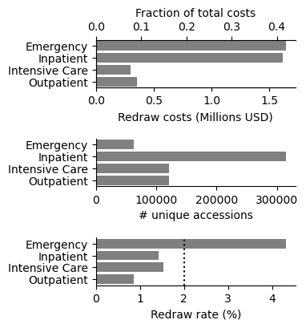
  

---

<h2>
  Most Hemolysis Costs Arise from a Small Number of Collectors
</h2>

  

    

    <ins>
      Pareto Principle 
    </ins>
    

      ~20% of the collectors  are responsible for  ~80% of the total hemolysis costs
    

    

  

  

    

      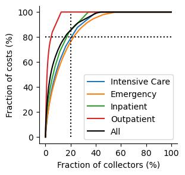
    

  

---

<h1>
  Significance of Pareto Principle
</h1>

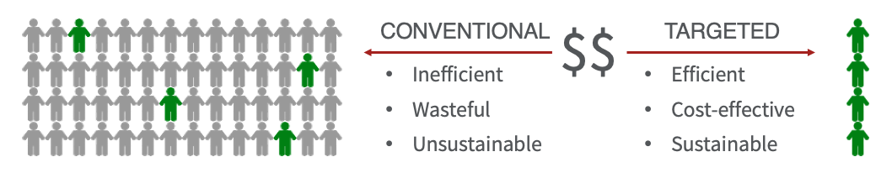

  A targeted training and feedback campaign might offer greater efficiency and scalability

  <ins>
    Key Question:
  </ins>

<h3 style='border:solid;text-align:center;padding:10px;border-radius:10px;margin-top:0px'>
  Can we prospectively identify the outliers that are most important to train? 
</h3>

---

<h2>
  Pareto Principle and Power Laws
</h2>

  

    

      The Pareto Principle is often observed for processes that exhibit a power law 
    

    

      For a power law distributed data, mean and variance can be undefined 
    

    

      <ins>
        Significance 
      </ins>
    

    
  
      <ul>
        <li>
          'Typical' cost is poorly defined 
        </li>
        <li>
          Difficult to define outliers
        </li>
      </ul>
    

  

  

      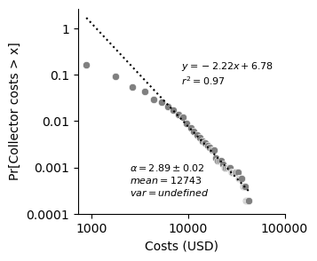
  
  

---

<h1>
  Power Laws Everywhere
</h1>

  

    

      Power law distributions arise in diverse artificial and natural systems
    

    

      Various generative mechanisms can give rise to power law phenomena
    

    <ul><li>
      Some mechanisms are  random 
    </li></ul>
    

      <ins>Key question</ins>
    

    
          
      Will the top 20% collectors continue to incur high costs in the future?
    

  

  

    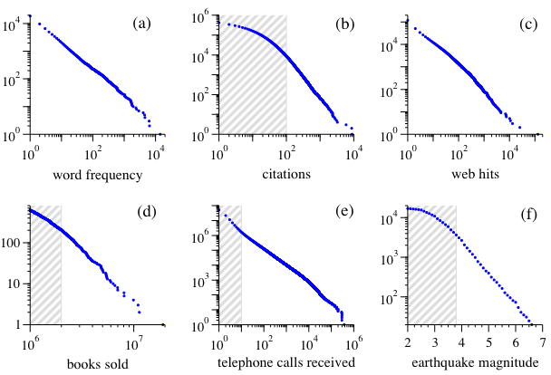
    

      Newman, Mej. “Power Laws, Pareto Distributions and Zipf’s Law.” Contemporary Physics 46, no. 5 (September 2005): 323–51. https://doi.org/10.1080/00107510500052444.
    

  

---

<h1>
  Wisdom from ChatGPT-4
</h1>

  <ins>
    Prompt
  </ins> 
  &emsp;Why do 20% of workers cause 80% of errors?

  <ins>
    Response
  </ins> 
  <i>
    ... It's important to note that the 80/20 ratio is not a strict rule but a general observation. Identifying the underlying causes of errors and addressing them through training, process improvements, and accountability measures is essential for reducing errors within any organization.
  </i>

---

<h1>
  Part 1: Summary
</h1>

  <ol>
    <li>
      Annual insitution level hemlolysis redraw costs estimates approached $4,000,000 
    </li>
    <li>
      The majority of costs arise from the Emergency and Inpatient settings
    </li>
    <li>
      20% of collectors account for 80% of hemolysis costs across care settings
  </ol>

---

  <h3>
    Part 2
  </h3>
  

    

      Automated and objective dectection of underperforming specimen collectors
    

  
  

---

<h1>
  <ins>
    Questions
  </ins>
</h1>

  <ol>
    <li>
      Can we identify non-random variation in collector performance?
    </li>
    <li>
      If so, does it help us to predict future hemolysis costs? 

---

<h1>
  Analyzing Per Collector Hemolysis and Volumes
</h1>

  

    

      &bull; Median HI chosen as performance metric 
      &emsp; - Ranged from 0.0 to 534 
      &emsp; - Heavy tailed distribution 
      &emsp; - Wide variation for low volume collectors 
    

    

      &bull; Specimen volumes 
      &emsp; - Ranged from 1 to 4620 
      &emsp; - Heavy tailed distribution
    

    

      <strong>Questions:</strong>  Is this all random performance variation? Which collectors (if any) need training?
    

  

  

    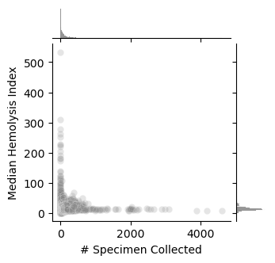
  
  

---

<h3>
  Modeling Random Performance Variation among Equally Skilled Collectors
</h3>

  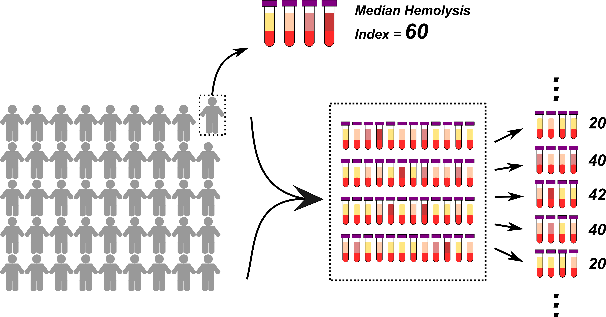

---

<h2>
  Extrapolating Extreme p-values from Limited Simulations
</h2>

  

    

      &bull; Distribution of median hemolysis index is  &emsp;appproximately log-normal 
      

        <ol>
          <li>
            Run modest number of trials (500) 
          </li>
          <li>
            Fit log-normal model
          </li>
          <li>
            Extrapolate p-value from fitted distribution
          </li>
        </ol>
      

    

  

  

    

      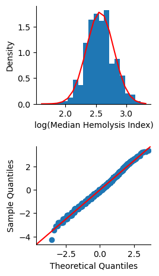
    
  
  

  

---

<h3 style='margin-bottom:30px'>
  Modeling Random and Nonrandom Variation in Collector Performance
</h3>
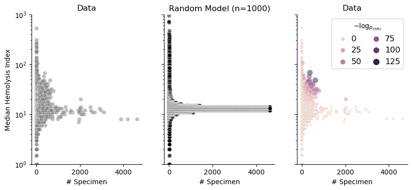

---

<h2>
  Statistical Outliers Tend to Incur Higher Costs
</h2>

  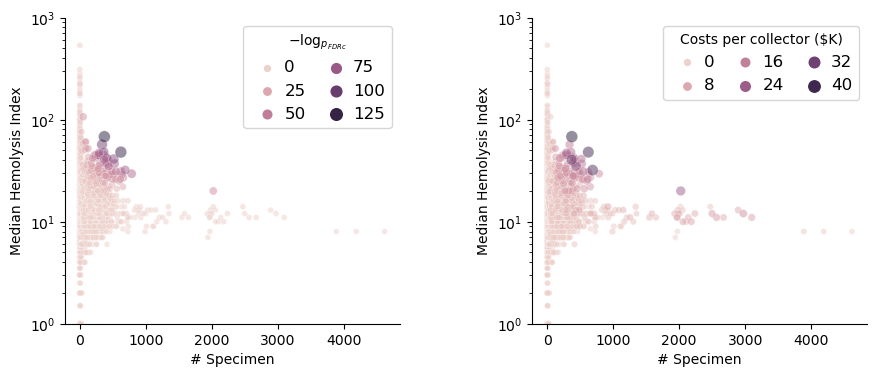

---

<h2>
  Top 20% by Statistical Ranking Predicts Top 20% by Costs
</h2>

  

    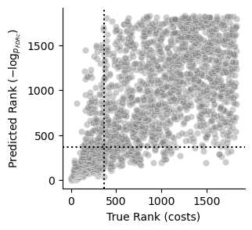
  

  

    <table border="1" class="dataframe">
    <tbody>
      <tr>
        <th>Se</th>
        <td>0.69</td>
      </tr>
      <tr>
        <th>Sp</th>
        <td>0.92</td>
      </tr>
      <tr>
        <th>PPV</th>
        <td>0.69</td>
      </tr>
      <tr>
        <th>Accuracy</th>
        <td>0.88</td>
      </tr>
      <tr>
        <th>F1-Score</th>
        <td>0.69</td>
      </tr>
      <tr>
        <th>MCC</th>
        <td>0.61</td>
      </tr>
    </tbody>
  </table>
  

---

<h1>
  Outlier Score is Predictive of Observed Costs
</h1>

  

    The degree to which observed collector performance is 'unexpected' by a model of random variation among equally skilled collectors is highly predictive of costs
    

  

  

    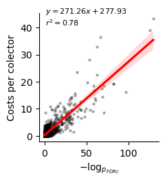
  

---

  <ins> 
    Key question
  </ins>

  Does the outlier score help to predict future hemolysis errors and costs?

<!-- 

  

  

  

  

 -->

---

<h2>
  Forecasting 2022 Costs Using December 2021 Data

  

  

    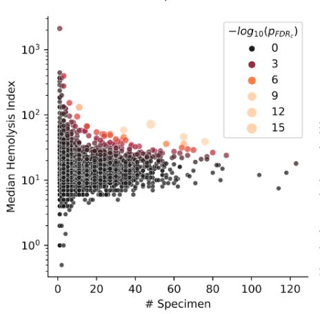
  

  

  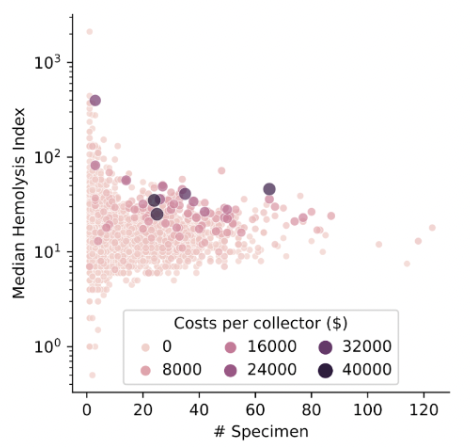

---

<h2>
  December 2021 Statistical Scores Predict 2022 20% Collectors
</h2>

  

    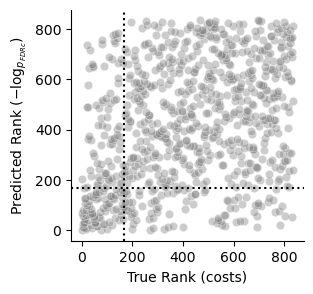
  

  

    <table border="1" class="dataframe">
  <thead>
    <tr style="text-align: right;">
      <th></th>
      <th>value</th>
    </tr>
  </thead>
  <tbody>
    <tr>
      <th>Se</th>
      <td>0.48</td>
    </tr>
    <tr>
      <th>Sp</th>
      <td>0.87</td>
    </tr>
    <tr>
      <th>PPV</th>
      <td>0.48</td>
    </tr>
    <tr>
      <th>Accuracy</th>
      <td>0.79</td>
    </tr>
    <tr>
      <th>F1-Score</th>
      <td>0.48</td>
    </tr>
    <tr>
      <th>MCC</th>
      <td>0.35</td>
    </tr>
  </tbody>
</table>

<!-- 
---

<h3>
  Analyzing Annual Costs per Collector
</h3>

  Variation in collector costs poorly explained by: 
  <ol style='margin-top:10px'>
    <li>
      degree of hemolysis 
    </li>
    <li>
       # of specimen collected 
    </li>
  <or>

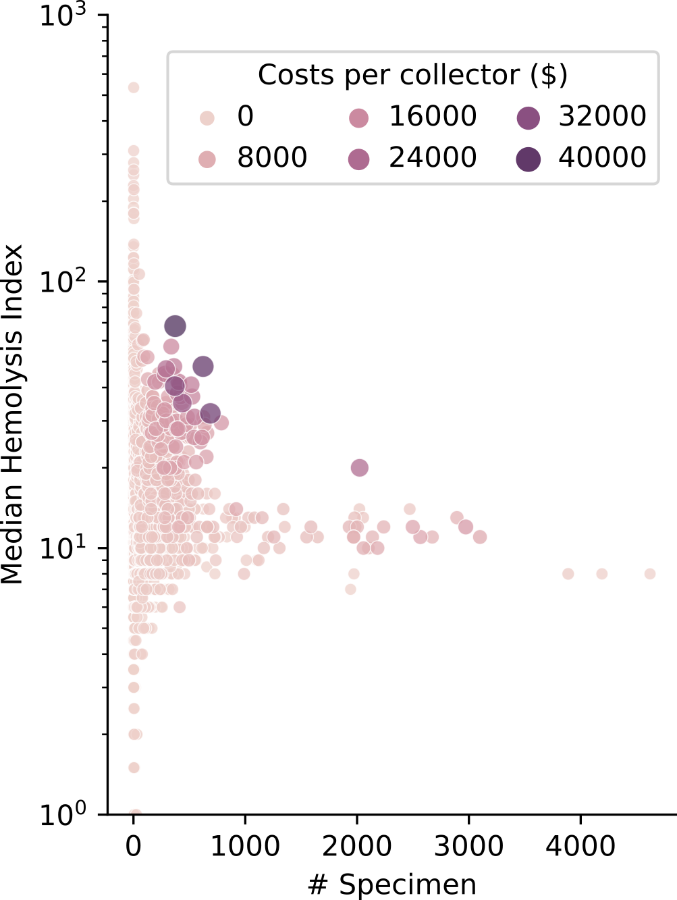 -->
<!-- 
---

<h3>
  Modeling Random Variation Among Equally Skilled Collectors
</h3>

  

    &bull; Random variation modeled  &emsp;using monte carlo process 
  

  

    &bull; Random model describes  &emsp;central tendency in data 
  

  

    &bull; High cost collectors outside  &emsp;bounds of random model
  

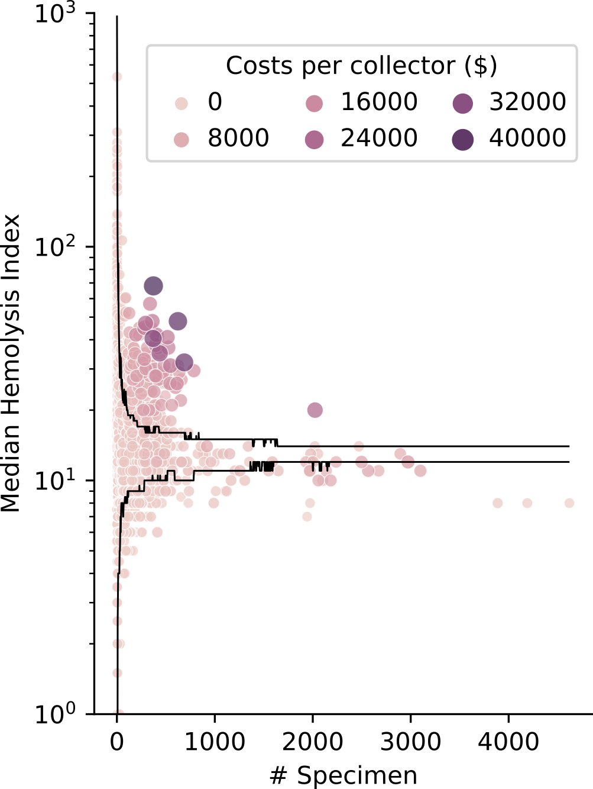 -->

<!-- 
---

<h3>
  High Cost Collector Performance that is Unexpected by Random Model
</h3>

  

    &bull; Monte-carlo model used to assign p-value 
    &bull; False discovery rate correction 
    &bull; Expectation values computed as -log(p)
     
    

       Statistical model explains 71% of the variation in per collector costs
    

  

  

    

      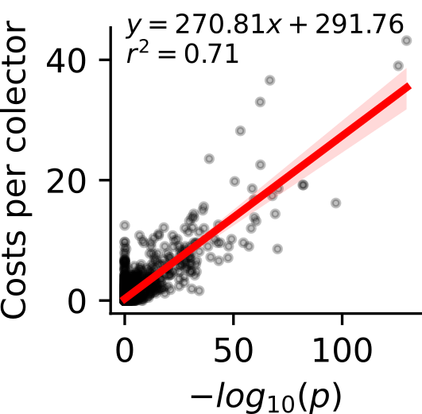
    

  

 -->

---

# Delivering automated feedback and training to reduce specimen collection errors

---

<h2>
  Methods (estimating blood culture contamination costs)
</h2>

  

    <h3>
      <ins>Blood culture contamination costs</ins>
    </h3>
    <strong>Retrospective:</strong> xx/xx/xxxx to yy/yy/yyyy 
    <strong>Single-institution:</strong> Barnes-Jewish Hospital 
    <strong>Study design:</strong> Observational 
    <strong>Data source:</strong> LIS (Cerner Millenium, Oracle)
    <strong>Inclusion criteria:</strong>  
    &emsp;&bull; Specimen drawn in study period 
    <strong>Contamination logic: </strong>
    &emsp;&bull; Grew likely commensual 
    &emsp;&bull; No repeat positive +/- 3 days 
    <strong>Cost model:</strong>  
    &emsp;&bull; Context dependent costs 
  

  

    BCC costs cartoon goes here
  

<!-- ---

<h1>
  Analyzing annual per collector data
</h1>

  &bull; High costs collectors tend to  &emsp;have higher hemolysis index 
  &bull; High costs collectors tend to  &emsp;collect more specimen 

  <ins>However:</ins> 
  Selecting based on hemolysis index or number of specimen misses the high costs collectors

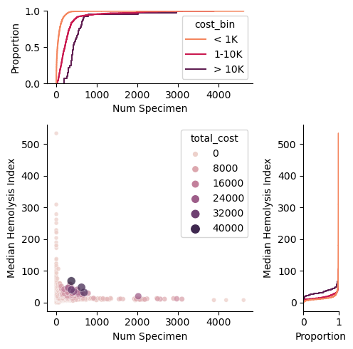 -->

<!-- ---

<h3>
  Analyzing Variation in Median Hemolysis Index per Collector
</h3>

  

    &bull; Median HI per collector varies widely 
    &bull; Variation lessens as # specimen increases 
    &bull; High costs collectors tend to have higher  &emsp;median HI and # specimens 
    &bull; Collectors with the highest median HI or #  &emsp;specimen captures low cost collectors 
    

      <ins>Hypothesis:</ins>
    

    

      Much of the variation in collector performance reflects random variation among equally skilled collectors
    

  

  

    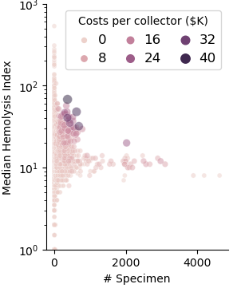
  

 -->

---
