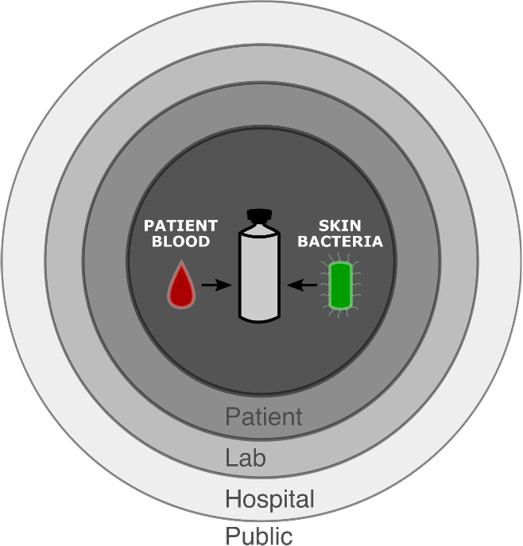
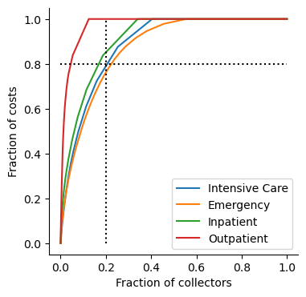

---

marp: true
theme: default
color: #000
backgroundColor: #fff
enableHtml: true	
paginate: true
style: |
  .columns {
    display: grid;
    grid-template-columns: repeat(2, minmax(0, 1fr));
    gap: 1rem;
  }
  .columns-left {
    background: white;
  }
  .columns-right {
    background: white;
  }

---

# Reducing Speimen Hemolysis and Blood Culture Contamination in the Emergency Department Through Automated Collector

 

### Mark A Zaydman, MD, PhD
Assistant Professor 
Department of Pathology and Immunology
Washington University School of Medicine

---

<h1>
  Disclosures
</h1>
<h5>
  Research Support
</h5>

  bioMerieux 

<h5>
  Speaking Honoraria
</h5>

  Sebia - "A Modern Approach to Screening for MGs using Digital Workflows" 
  Siemens - "FLC Testing in Multiple Myeloma and Kidney Disease" 
  API - 2023 Annual Summit (Pittsburgh, PA) 
  ADLM - 2023 Annual Scientific Meeting (Anaheim, CA)

<h5>
  Patents
</h5>

  US20210311046 - Method of Reducing Interference in Immunoassays
  WO2022198218A1 - Spectral Correlation Analysis of Layered Evolutionary Signals

---

<h1>Errors Occuring During Specimen Collection</h1>

 

---

<h1><i>In vitro</i> Hemolysis Occurs During or After Collection</h1>
 

  

    

      <ins><i>In vitro</i> hemolysis</ins>   
      Non-biological rupturing of blood cells leading to the release of intracellular contents into the fluid fraction of the specimen (ex. Potassium, Hemoglobin)
    

  

  

    
  

 

Lippi, Giuseppe, Gianfranco Cervellin, and Camilla Mattiuzzi. “Critical Review and Meta-Analysis of Spurious Hemolysis in Blood Samples Collected from Intravenous Catheters.” Biochemia Medica, 2013, 193–200. https://doi.org/10.11613/BM.2013.022.

---

<h2><i>In vitro</i> Hemolysis Interfers with Laboratories in Complex Ways</h2>
 

  

    

      <ins>Hemoytic inteference mechanisms</ins> 
      &nbsp;- Elevation of intracellular analytes 
      &nbsp;- Dilution of extracellular analytes 
      &nbsp;- Optical interferance 
      &nbsp;- Enzymatic interferance 
    

  

  

    
  

 

  Lippi, Giuseppe, Norbert Blanckaert, Pierangelo Bonini, Sol Green, Steve Kitchen, Vladimir Palicka, Anne J. Vassault, and Mario Plebani. “Haemolysis: An Overview of the Leading Cause of Unsuitable Specimens in Clinical Laboratories.” Clinical Chemistry and Laboratory Medicine 46, no. 6 (January 1, 2008). https://doi.org/10.1515/CCLM.2008.170.

---

<h2><i>In vitro</i> Hemolysis is the Most Common Cause of Sample Rejection</h2>
 

  

    

      Inaccurate results can harm patients
    

    

      Laboratories monitor for free Hgb 
      &nbsp;- Visual inspection 
      &nbsp;- Spectrophotometric detection 
    

    

      Hemolyzed specimens may be rejected 
      &nbsp;- the most frequent cause of rejection
    

  

  

    
  

 

  Jones, B. A., R. R. Calam, and P. J. Howanitz. “Chemistry Specimen Acceptability: A College of American Pathologists Q-Probes Study of 453 Laboratories.” Archives of Pathology & Laboratory Medicine 121, no. 1 (January 1997): 19–26.

---

<h2>Specimen Rejection Degrades Care and Increases Costs</h2>

  

    

      <strong><ins>Degraded care</ins></strong> 
      &nbsp;- Delayed/missed diagnosis 
      &nbsp;- Repeat phlebotomy 
    

    

      <strong><ins>Increased costs</ins></strong> 
      &nbsp;- Prolonged length of stay 
      &nbsp;- Consumables 
      &nbsp;- Nurse/phlebotomists time 
      &nbsp;- Laboratory resources 
      &nbsp;- Downstream harms of medical errors* 
      &emsp;*Difficult to account for
    
    
  

  

    <table style='padding-top:10px;padding-bottom:10px;text-align:center'>    
      <tr>
        <th>Setting</th>
        <th>Costs</th>
        <th>Reference</th>
      </tr>
      <tr>
        <td>Emergency</td>
        <td>$600.00</td>
        <td style='font-size:16px'>Phelan, Michael P., et. al., JALM 6(6):2021,  Pgs 1607–1610</td>
      </tr>                              
      <tr>
        <td>Inpatient</td>
        <td>$357.15</td>
        <td style='font-size:16px'>Green, Sol F. Clin Biochem 46(13-14):2013, Pgs 1175–79</td>
      </tr>
      <tr>
        <td>Critical care</td>
        <td>$162.18</td>
        <td style='font-size:16px'>Green, Sol F. Clin Biochem 46(13-14):2013, Pgs 1175–79</td>
      </tr>
      <tr>
        <td>Outpatient</td>
        <td>$337.05</td>
        <td style='font-size:16px'>Green, Sol F. Clin Biochem 46(13-14):2013, Pgs 1175–79</td>
      </tr>
    </table>
  

 

  Doern, Gary V., Karen C. Carroll, Daniel J. Diekema, Kevin W. Garey, Mark E. Rupp, Melvin P. Weinstein, and Daniel J. Sexton. “Practical Guidance for Clinical Microbiology Laboratories: A Comprehensive Update on the Problem of Blood Culture Contamination and a Discussion of Methods for Addressing the Problem.” Clinical Microbiology Reviews 33, no. 1 (December 18, 2019): e00009-19. https://doi.org/10.1128/CMR.00009-19.

---

<h1>
  Hemolysis is a Common Preanalytical Error
</h1>

  

  

  

  
  

---

<h1>
  Training and Feedback Reduce Hemolysis Rates
</h1>

  

  

  

  
  

---

<h1>Blood Culture Contamination</h1>
 

  

    

      <ins>Blood culture contamination</ins>
    

    

      The introduction of non-pathogenic bacteria from the patients skin or environment into a blood culture speimen during collection giving the false impression that the patient has a blood stream infection 
    

  

  

    
  

 

  Doern, Gary V., Karen C. Carroll, Daniel J. Diekema, Kevin W. Garey, Mark E. Rupp, Melvin P. Weinstein, and Daniel J. Sexton. “Practical Guidance for Clinical Microbiology Laboratories: A Comprehensive Update on the Problem of Blood Culture Contamination and a Discussion of Methods for Addressing the Problem.” Clinical Microbiology Reviews 33, no. 1 (December 18, 2019): e00009-19. https://doi.org/10.1128/CMR.00009-19.

---

<h1>Blood Culture Contamination Causes Broad Harms</h1>

  

    

      <ins>Patient</ins>  
      - 3 additional days of IV antibiotics 
      - 1-5 additional days of hospitalization 
      - $9,000 additional hospitalization costs
    

    

      <ins>Microbiology lab</ins>  
      - Technician time 
      - Reagents
    
    
    

      <ins>Hospital</ins>  
      - Costs  of prolonged hospitalization 
      - Quality penalties (CLABSI)
    
        
    

      <ins>Public</ins>  
      - Increase prevalence of MDRO
    
        
  

  

    
      
    

      Bates, David W. JAMA 265, no. 3 (January 16, 1991): 365.  
      Gander, RM et. al. JCM 47, no. 4 (April 2009): 1021–24. 
      Doern, GV et al. CMR 33, no. 1 (December 18, 2019): e00009-19. 
    

  

---

<h1>
  Blood Culture Contamination is Common
</h1>

  

  

  

  
  

---

<h1>
  Training and Feedback Reduce Contamination Rates
</h1>

  

  

  

  
  

---

<h2>
 Barriers to Implementing Collector Feedback and Training 
</h2>
 

  

---

<h2>
  Our Hypothesis
</h2>

  We hypothesized that digital technologies        can remove the barriers to mounting an effective education and feedback campaign to reduce specimen collection error rates

  

---

<h1>
  Our goal
</h1>

  To develop an end-to-end automated solution to provide scalable and sustainable collector feedback and performance-based training to reduce specimen collection errors 

  

---

  <h2>
    Outline for this Talk 
  </h2>

  <h3>
    Part 1
  </h3>
  

    

      Estimating the institution-level costs of  blood specimen hemolysis and blood culture contamination
    

  

  <h3>
    Part 2
  </h3>
  

    

      Automating the dectection of underperforming specimen collectors
    

  
  
  <h3>
    Part 3
  </h3>
  
  
    

      Automating the delivery of personalized collector feedback and training
    

  

 
 

---
<h1>
  Part 1
</h3>

  

  Estimating the institution-level costs of  blood specimen hemolysis and blood culture contamination
    

---

  

    <h1>
      Study Context
    </h1>
    <h5>
      Barnes-Jewish Hospital (BJH)
    </h5>
    

      &bull; St. Louis, Missouri, USA 
      &bull; 1266 adult beds 
      &bull; Tertiary academic care center 
      &emsp;- Washington University &emsp;&nbsp;&nbsp;&nbsp;School of Medicine 
    

  

     
     
  

---

<h2>
  Methods (estimating hemolysis costs)
</h2>

  

    <!-- <h3>
      <ins>Hemolysis costs</ins>
    </h3> -->
    <strong>Retrospective:</strong> 1/1/2022 to 1/1/2023 
    <strong>Single-institution:</strong> Barnes-Jewish Hospital 
    <strong>Study design:</strong> Observational 
    <strong>Data source:</strong> LIS (Cerner Millenium, Oracle)
    <strong>Inclusion criteria:</strong>  
    &emsp;&bull; Specimen drawn in study period 
    &emsp;&bull; Hemolysis index (HI) measured 
    <strong>Cost model:</strong>  
    &emsp;&bull; Redrawn if HI > threshold for 1+ analyte 
    &emsp;&bull; Fixed, context dependent redraw costs 
  

  

    <table style='padding-top:0px;padding-bottom:10px;text-align:center'>    
      <tr>
        <th>Setting</th>
        <th>Costs</th>
        <th>Reference</th>
      </tr>
      <tr>
        <td>Emergency</td>
        <td>$600.00</td>
        <td style='font-size:16px'>Phelan, Michael P., et. al., JALM 6(6):2021,  Pgs 1607–1610</td>
      </tr>                              
      <tr>
        <td>Inpatient</td>
        <td>$357.15</td>
        <td style='font-size:16px'>Green, Sol F. Clin Biochem 46(13-14):2013, Pgs 1175–79</td>
      </tr>
      <tr>
        <td>Critical care</td>
        <td>$162.18</td>
        <td style='font-size:16px'>Green, Sol F. Clin Biochem 46(13-14):2013, Pgs 1175–79</td>
      </tr>
      <tr>
        <td>Outpatient</td>
        <td>$337.05</td>
        <td style='font-size:16px'>Green, Sol F. Clin Biochem 46(13-14):2013, Pgs 1175–79</td>
      </tr>
    </table>
  

---

  

    <h1>
      Hemolysis Indices
    </h1>
    Automated detection and quantitation 
    Based on spectrophotemetric measurement  
    <ins>BJH</ins> 
    Measured on Roche Cobas c702 
    Plasma samples 
  

  

    

      
      
    

  

  Ishiguro, Akiyo, Mitsuaki Nishioka, Akihiro Morishige, Reo Kawano, Toshihiko Kobayashi, Aki Fujinaga, Fumiya Takagi, et al. “What Is the Best Wavelength for the Measurement of Hemolysis Index?” Clinica Chimica Acta 510 (November 2020): 15–20. https://doi.org/10.1016/j.cca.2020.06.046.

---

<h3>
  Annual Institutional Hemolysis Redraw Costs are Nearly $4,000,000
</h3>

  

    <ins>
      Assumptions 
    </ins>
    &bull; Results supressed for HI > threshold 
    &bull; All specimen with supressed results  &emsp;incur redraw costs
  

  

    <table style='margin-top:0px;margin-left:50px;text-align:right'>
      <tr>
        <td>
          # specimens
        </td>
        <td>
          620,756
        </td>        
      </tr>
      <tr>
        <td>
          # collectors
        </td>
        <td>
          4994
        </td>        
      </tr>
      <tr>
        <td>
          HI > 50
        </td>
        <td>
          12.1%
        </td>        
      </tr>    
      <tr>
        <td>
          HI > 100
        </td>
        <td>
          5.0%
        </td>        
      </tr>
      <tr>
        <td>
          HI > 250
        </td>
        <td>
          1.4%
        </td>        
      </tr>   
      <tr>
        <td>
          Rejection rate
        </td>
        <td>
          1.6%
        </td>        
      </tr>   
      <tr>
        <td>
          Total costs
        </td>
        <td>
          $3,910,530.54
        </td>        
      </tr>                          
    </table>
  

---

<!-- 
 -->
  <!-- 
 -->
<h3>
  Emergency and Inpatient Settings Account Majority of Redraw Costs
</h3>

  

    <!-- &bull; Each account for ~40% of total costs  -->
    &bull; Inpatient costs are driven by volume 
    &bull; ED costs driven by error rates and  &emsp; higher redraw costs  
  

  

    
  

---

<h2>
  Most Hemolysis Costs Arise from a Small Number of Collectors
</h2>

  

    

    <ins>
      Pareto Principle 
    </ins>
    

      ~20% of the collectors  are responsible for  ~80% of the total hemolysis costs
    

    

  

  

    

      
    

  

---

<h2>
  Pareto Principle Appears Across Patient Encounter Types
</h2>

  

    Hemolysis costs across different patient care setting arise from a subset of collectors
  

  

    

      
    

  

---

  How to identify the subset of collectors that are responsible for the majority of costs?

---

  <h3>
    Part 2
  </h3>
  

    

      Automating the dectection of underperforming specimen collectors
    

  
  
  
---

# Identifying high value targets for collector retraining

---

# Delivering automated feedback and training to reduce specimen collection errors

---

<h2>
  Methods (estimating blood culture contamination costs)
</h2>

  

    <h3>
      <ins>Blood culture contamination costs</ins>
    </h3>
    <strong>Retrospective:</strong> xx/xx/xxxx to yy/yy/yyyy 
    <strong>Single-institution:</strong> Barnes-Jewish Hospital 
    <strong>Study design:</strong> Observational 
    <strong>Data source:</strong> LIS (Cerner Millenium, Oracle)
    <strong>Inclusion criteria:</strong>  
    &emsp;&bull; Specimen drawn in study period 
    <strong>Contamination logic: </strong>
    &emsp;&bull; Grew likely commensual 
    &emsp;&bull; No repeat positive +/- 3 days 
    <strong>Cost model:</strong>  
    &emsp;&bull; Context dependent costs 
  

  

    BCC costs cartoon goes here
  

